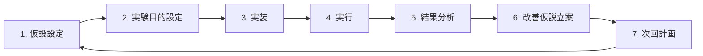

# AI と協働でモデリング業務を半自動化した話

前回はデータサイエンティストのモデリング業務における単純作業をどうにかしたいという話をしました。

今回は実際に単純作業を AI に任せてモデリング業務を半自動化した話をしたいと思います。

## AI と協働という発想

下記のようなモデリングの実験サイクルのうちでも、「実装／実行／結果分析」は AI に任せて、データサイエンティストは「仮設設定／実験目的設定／改善仮説立案」に注力できるのではないかと考えました。

---

具体的には、次のようなイメージです。

### Before（前回記事の再掲）

- 実験設定ファイルのパラメータ調整／実行コマンドのコピペ・修正  
  ➡️ 仕様を変えながら実験。 私調べでは v3 くらいから訳わかんなくなる

- ログファイルを漁って原因調査  
  ➡️ アドホックなスクリプトが増殖して 1 週間後には訳わかんなくなる

---

### After（AI 協働後）

- AI が設定ファイルを自動生成・管理  
  ➡️ AI が実験の経緯を記録してくれる。  
  私）「実験 005 で何をやったっけ？」→ AI が回答してくれる

- ログファイルを漁って異常値の原因調査  
  ➡️ AI の原因調査結果を確認して、すぐに改善仮説立案できる  
  私）「実験結果で気になるところを探して」  
  AI）「Train と CV のスコアが乖離していて過学習の兆候が見える」
  私）「正則化を強めてみるか…」

---

## AI と協働をどう実現したのか

AI エージェントは GitHub Copilot を使いました。

さらに、モデリング業務の説明を 3 つのドキュメントにして AI に知識を教えています。

1. **AI の役割**を教える指示書
2. **実験サイクルの進め方**を教える手順書
3. **どのパラメータを変更できるか／実行方法**を教える仕様書

詳細は省きますが、重要なのは「モデリング業務を協働してもらう」ことを簡潔に伝えつつ、実験について「手順を細かく記載」することでした。

そのために 3 つのファイルに分けています。

まず、概要を「AI の役割を教える指示書」で伝え、モデリング業務について「実験サイクルの進め方」を理解してもらい、詳細は「どのパラメータを変更できるか／実行方法」に記載する。という感じです。

---

## 実際にやってみてどうだったか

先ほど作った 3 つの知識を 与えて、AI と協働することで、期待通りの変化がありました...

ちなみに、取り組んだタスクは株価の上昇予測です。

このタスクの具体的な内容については今後、別記事でまとめたいと思います。

---

### 変化 1: 「作業脳」から「戦略脳」へのシフト

「この処理どう書こうか？」などを考える作業脳、「次の実験はどうするべきか？」などを考える戦略脳と呼ぶことにすれば、AI と協働する前は 2 つの脳の切り替えがしんどいと感じることがありました。

特に作業脳 → 戦略脳に切り替える前に、一旦「ふぅ〜😩」ってなってしまうんですよね。これのせいで実験サイクルが数回しづらいと感じていました。

でも、AI と協働するようになってからは、作業は AI に任せて自分は「戦略脳」の時間が続くので集中が途切れずぐるぐるとサイクルが回るようになったんです！

---

**具体的な例**:

戦略脳) 「AUC は高いのに、Recall と Precision がすごい低いな。予測値の分布をみて確認するか。」　　
作業脳) 「予測値の分布をみたいから、モデル読み込んで、テストデータ読み込んで、推論処理を書いて、ヒストグラムをプロットしてファイルに保存すればいいか...」→ （コーディング作業）  
「ふぅ〜😩」  
戦略脳) 「やっぱり分布偏ってるな。（ちょっと疲れたし、一旦休憩するか...）」

ただグーたらなだけな気がしますが、でも実際こんなイメージです笑

---

それが AI と協働になると...

戦略脳) 「AUC は高いのに、Recall と Precision がすごい低いな。予測値の分布をみて確認するか。」　　
AI🧠) 「分布が偏っているようです」  
戦略脳) 「やっぱりそうだよな。クラス不均衡になってそうだから class weight 追加してみるか...」

私にとってはかもしれないですが、「ふぅ〜😩」ってならないのはとても助かります。

---

### 変化 2:中断・再開コストの激減

上の話と少し似ていて、実験サイクルに限らずコーディングもそうですが、とにかく途切れること／そこから再開する時にしんどくなります。

「あれ、私何していたっけ？」と行方不明になることは日常茶飯事でした。

でも、AI と協働するようになると、作業ログを残してくれているので「私）今までの経過をまとめて」と言えば AI がいい感じにまとめてくれます。

それだけではなく、「（今実験 008 をやっているとして、）実験 003 で何をしていたかを教えて」と言えば過去どういう経緯でどんな実験をしたのかすぐに回答してくれます。

「戦略脳」に集中できますし、再開コストが低いのでモチベが下がりにくくなったのが良いポイントでした！

---

**具体的な例**:

ある平日の夜 1 時間のモデリングにて...

Before)  
私）「週末の続きやるか〜。...何してたっけな。」  
〜 30 分経過 〜  
私）「(ふぅ〜😩) 次何しようとしてたかやっと分かったわ。コード書き換えないと...」  
〜 30 分経過 〜  
私）「もう１時間経ってる...結局 1 サイクルしか回せてない。寝よう。」

そして、実験ログを取っていないので、この 1 サイクルのことも次回は忘れているのである。

---

After)

私）「週末の続きやるか〜。...何してたっけな。AI に聞こう。」  
AI）「実験 001〜008 では〇〇で、009〜012 は XX を計画してました。何から始めますか？」  
私）「そうだった。009 から始めます！」  
〜 1 時間経過 〜  
私）「１時間経ってる...5 サイクルもできた！」  
AI）「実験 009〜014 を実験ログにまとめました 📝」  
私) 「あざす」

これは平日のプライベートな例ですが、仕事でも会議・チャット返信・別業務の差し込みなどで中断／再開することはありますよね。

復帰が早いこと、ログ付けを任せられることの恩恵はとても大きいです。

---

### 変化 3: 知識の蓄積

上の例では自分自身に対して、実験過程を残して・伝えることをしています。

でもこれは私 1 人に限らず、チームで共有することもできると思います。

例えば、

- 作業手順書を作って引き継ぎを簡単にする
- 先輩データサイエンティストから後輩へモデリング業務の思考回路を教育する

などでしょうか。

特に 2 つ目は、データサイエンティストの業務って属人的になりがちだと考えているので、とても便利なのではないかと考えています。

私も以前、異動された〇〇さんが昔作ったモデルを改善するみたいな案件をもらった時に、〇〇さんからスクリプト 1 つだけもらってなんだこれは？ってなったことあります笑

その時どうしてそうやって作ったのか、なんでこう設定してあるのかを一緒に知れていたら...

ちなみに、そのモデルは私が改善した後に後輩に引き継いだのですが、リポジトリのリンクを渡してわかんないことあったら聞いて〜みたいな感じにしてましたね。（人はなぜ同じ過ちを繰り返すのか...）

しかし、今となっては AI に任せることができるので、担当者が過程を残すコストも減り、それによって引き継ぎ者がインプットするコストも減らせるはずです！

---

## まとめ

ここまで読んでいただいて、

「これ、自分もやってみたい！」
「でも、何から始めれば...？」

と思った方もいるのではないでしょうか？

**始めるのは簡単です**

1. **GitHub Copilot を使ってみる**

   - エージェントはなんでも良いと思います。私は CLINE と GitHub Copilot を試しましたが後者の方がよかったです。
   - 私調べですが、CLINE は言われたことを完璧にこなす超真面目な同僚で、GitHub Copilot は言われてないことも気を利かせてやってくれる世話焼きな同僚という印象です。この協働では後者の方がさまざまな想像を働かせてくれてとても便利でした。

2. **あなたの思考回路を Markdown で書いてみる**

   - 例えば、「モデリングの時はこういう順番で考えるよな。」という思考回路を書き起こしてみることで整理されますし、AI に知識として与えることできます。
   - 皆さんの様々な業務の思考回路には興味がありますし、そこから得られる学びもありそうですね！

3. **面倒だなと思う単純作業を AI に任せる**
   - この作業面倒だなって思う部分があるはずです。それが AI で可能なのか判断し、可能そうであれば AI に任せちゃいましょう
   - 具体的は作業手順書として Markdown を書き、AI に知識として与えます。

---

この記事が「単純作業に疲れた」データサイエンティストの皆さんの
参考になれば嬉しいです！

_AI と協働して、本来の「考える仕事」に集中しましょう_
