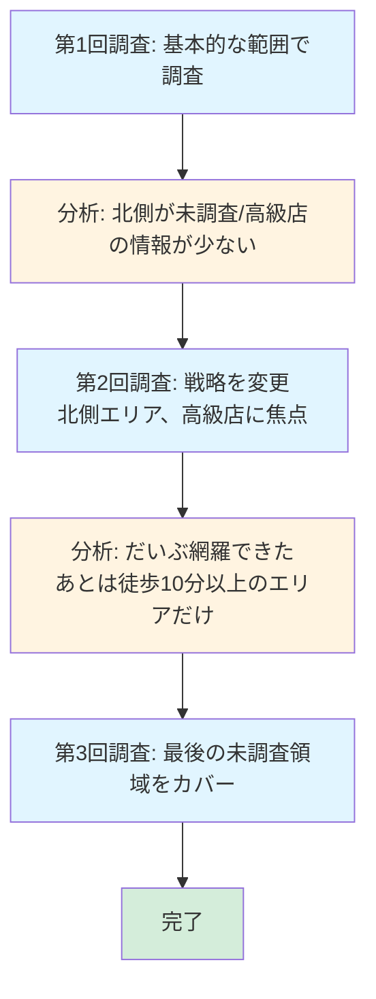
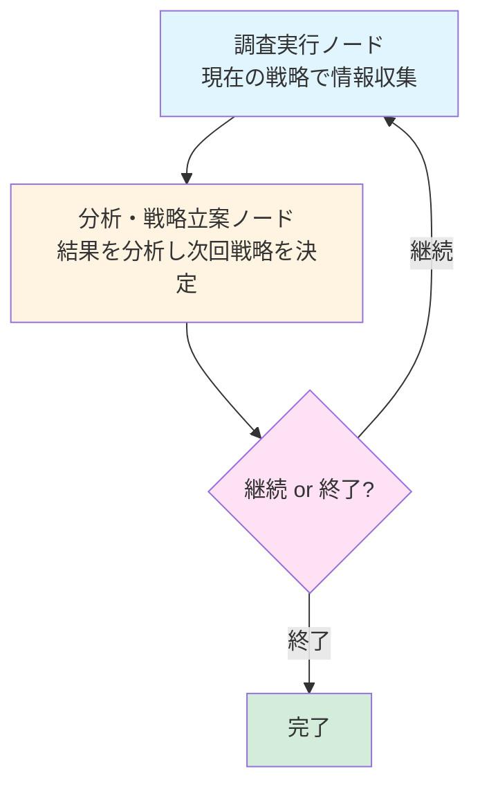

## 1.検索が上手な人って

皆さんの周りに"検索上手な人"いませんか？

私の場合は、いい感じのお店をめちゃ早く見つけて、何個か提案してくれるエリートがいます笑

たとえば、「渋谷のカフェ」を探すとしましょう。

**検索が苦手な人**は、たぶんこんな感じ：

- 「渋谷 カフェ」で検索
- 数百件の結果が一気に出てくる
- 情報が多すぎて、どれが自分に合ってるのか整理できない

**検索が上手な人**は、一方でこう動くはず：

1. まず「渋谷駅 カフェ」で検索
2. 結果を見て「情報が多いな。じゃあ北側から調べよう」
3. 次に「渋谷 カフェ 北側」で検索
4. さらに「あ、代官山寄りのエリアも調べてみよう」→「代官山寄り おしゃれ カフェ」

この違いは、**「結果を見て → 足りない部分を分析 → 次の戦略を立てる」** というサイクルをしてるか／いないかという点です。

これって単なる「検索のコツ」ではなく、いろいろな調査タスクで精度を高める本質的な思考パターンなんじゃないかと思いました。

そこで、この記事ではこの段階的・適応的な思考を AI に自律的に実行させる方法について書いてみます。

## 2. AI も一発でうまく調査できないことがあるのはなぜ？

そもそも AI で調査が一発で簡単にできたらいいですよね…

最近では OpenAI の Deep Research や Perplexity など、調査に特化した AI サービスも登場しています。これらは段階的な調査を自動化することで、この問題に対処しているはずです。

この記事では、**この構造的な問題を自分たちでも解消できる**ことを示すことをモチベーションとします。

さらにその先に自分の調査タスクに最適化できると良いですね！

ではまず、なぜ AI の一発調査が難しいのか、その理由を整理しましょう。

### 問題 1：情報空間の広大さ

「渋谷のカフェ」というクエリだけでも、数百件、数千件の情報が存在するはずです…

- どのエリアを重点的に調べるべき？
- どんな種類のカフェを優先する？
- 駅からどのくらいの範囲まで調べる？

これらの条件が曖昧なまま調査すると、結果は偏ったり、重要な情報が抜け落ちたりしちゃいます。

### 問題 2：LLM の出力トークン制限

LLM（大規模言語モデル）には、一度に出力できる情報量に物理的な制限があります。

不自然な出力にならないように、ちょうど良い長さで情報を出力する必要があるため、一発で"全ての情報"を取得することは難しいです。

### 問題 3：優先順位の不明確さ

調査を始める前に、AI は何を重視すべきかわかっていません。

- 「人気店」を探してるの？
- 「穴場」を探してるの？
- 「エリアの網羅性」が重要なの？

そしてこれは実際に調査を始めて結果を見ないと、次に何を調べるべきかが見えてこないものです。

### 結論：段階的・適応的なアプローチが論理的に必要

このような理由から、高精度な調査には**段階的・適応的なアプローチ**が必須です：

1. 現時点の条件で調査を実行
2. 結果を分析（何が足りない？偏りは？）
3. 次の戦略を立てる（未調査領域に焦点を当てる）
4. これを繰り返す

これが、人間の「検索上手」の本質で、AI を使った調査にも実装すべき思考パターンと言えます。

## 3. 適応的調査の仕組み

では、この適応的調査をどう設計すればいいんでしょうか？

**適応的調査の具体例**：



### 適応的調査の 3 ステップ

1. **調査実行**：現時点の戦略に基づいて情報収集
2. **分析**：調査結果を評価（何が足りない？偏りは？）
3. **戦略立案**：次回の調査範囲・条件を決定

このサイクルを繰り返すことで、段階的に調査の精度と網羅性を向上させていきます。

### 実装例：駅周辺飲食店調査

この記事では、具体例として「駅周辺の飲食店エリア調査」を取り上げます。

もちろん、市場調査や競合分析など他の調査タスクにも応用できるタスクになっています。

## 4. LangGraph による実装設計

適応的調査を AI に実装するために**LangGraph**を使用します。

LangGraph は、複雑な AI ワークフローを状態管理とグラフ構造で表現できるフレームワークです。

### システムアーキテクチャ

適応的調査システムは、以下の 2 つのノードで構成されます：



### ノードの役割

**① 調査実行ノード**

- 現在の調査戦略に基づいて情報を収集
- Web 検索 API を使って実際の情報を取得
- 調査結果を構造化データとして保存

**② 分析・戦略立案ノード**

- 累積的な調査履歴を分析
- 未調査領域やギャップを特定
- 次回の調査戦略を立案
- 継続の必要性を判定

### ループ制御

重要なのは、AI が自律的に「まだ足りないか？」を判断するところです。

- **継続する場合**：未調査領域がある、情報の偏りがある
- **終了する場合**：十分な網羅性を達成した、最大回数に到達した

## 5. 実装の核心

ここでは、実装の重要な部分をコードと共に解説します。

### 5-1. 状態管理：調査履歴の蓄積

LangGraph では、**reducer 機能**を使った状態管理ができます。

階的に情報を蓄積しながら調査を進めるために、各ノードが返した調査結果が**自動的に累積**されるようにしています。

```python
from langgraph.graph import MessagesState
from typing import Annotated, List

# カスタムreducer関数
def merge_survey_history(existing: List, new: List) -> List:
    """各回の調査サマリー履歴を結合する"""
    return existing + new

# 状態定義
class RestaurantSurveyState(MessagesState):
    station_name: Annotated[str, "調査対象の駅名"]
    max_iterations: Annotated[int, "最大調査回数"]

    # 調査結果の蓄積（自動的に結合される）
    survey_iteration: Annotated[int, "現在の調査回数"]
    discovered_areas: Annotated[List[FoodArea], merge_areas]
    survey_history: Annotated[List[SurveySummary], merge_survey_history]

    # 制御フラグ
    should_continue: Annotated[bool, "調査を継続するか"]
```

### 5-2. 継続判定：LLM に「まだ足りないか？」を判断させる

分析・戦略立案ノードでは、LLM に継続判定を任せます。

```python
from langchain_openai import ChatOpenAI
from langchain_core.prompts import ChatPromptTemplate

def analysis_and_planning_node(state: RestaurantSurveyState):
    """調査結果を分析し、次回戦略を立案"""

    # 構造化出力を使用するLLM
    analysis_llm = ChatOpenAI(model="gpt-5", temperature=0)
    structured_llm = analysis_llm.with_structured_output(AnalysisNodeResponse)

    analysis_prompt = ChatPromptTemplate.from_messages([
        ("system", """
あなたは調査の戦略アナリストです。
累積的な調査履歴を分析し、継続判定と次回戦略を決定してください。

継続判定基準：
- 新規情報発見の可能性（地理的・カテゴリ的ギャップ）
- 調査品質の向上余地
- 最大回数との関係

結果を構造化された形式で出力してください。
        """),
        ("user", f"""
駅名: {state["station_name"]}
調査履歴: {state["survey_history"]}

上記を分析し、以下を判定してください：
1. 調査継続の必要性と根拠
2. 未調査領域の特定
3. 次回調査戦略（継続の場合）
        """)
    ])

    # 構造化分析の実行
    chain = analysis_prompt | structured_llm
    analysis_result = chain.invoke({})

    # 継続判定
    should_continue = (
        analysis_result.continue_survey and
        state["survey_iteration"] < state["max_iterations"]
    )

    return {
        "should_continue": should_continue,
        "completion_reason": analysis_result.continuation_reason,
        "next_plan": _generate_next_plan(state, analysis_result) if should_continue else None
    }
```

### 5-3. 次回戦略：未調査領域を自動特定

継続すると判定された場合、次回の調査戦略を生成します。

```python
def _generate_next_plan(state, analysis_result) -> NextSurveyPlan:
    """LLMを使用して次回調査計画を生成"""

    plan_llm = ChatOpenAI(model="gpt-5-mini", temperature=0)
    structured_plan_llm = plan_llm.with_structured_output(NextSurveyPlan)

    plan_prompt = ChatPromptTemplate.from_messages([
        ("system", """
あなたは調査の戦略プランナーです。
累積調査履歴と分析結果を踏まえ、次回調査の具体的戦略を立案してください。

考慮ポイント：
- これまでの調査で見落とした可能性のある領域
- 戦略的に重要な未調査エリア
- 除外すべき既調査内容
        """),
        ("user", f"""
最新の分析結果: {analysis_result}

次回調査の戦略を詳細に立案してください。
特に以下を明確に：
- 重点調査エリア
- 検索クエリ
- 除外条件
        """)
    ])

    chain = plan_prompt | structured_plan_llm
    return chain.invoke({})
```

この仕組みにより、AI は自律的に「次は何を調べるべきか」を判断します。

### 5-4. ワークフローの構築

最後に、これらのノードを LangGraph で繋ぎます。

```python
from langgraph.graph import StateGraph, END

# ワークフロー構築
workflow = StateGraph(RestaurantSurveyState)

# ノードの追加
workflow.add_node("restaurant_survey_node", restaurant_survey_node)
workflow.add_node("analysis_and_planning_node", analysis_and_planning_node)

# エントリーポイント
workflow.set_entry_point("restaurant_survey_node")

# 調査実行後は必ず分析へ
workflow.add_edge("restaurant_survey_node", "analysis_and_planning_node")

# 分析後は継続判定に基づいて次回調査または終了
workflow.add_conditional_edges(
    "analysis_and_planning_node",
    should_continue_adaptive_survey,
    {
        "restaurant_survey_node": "restaurant_survey_node",
        END: END
    }
)

# コンパイル
adaptive_survey_app = workflow.compile()
```

この構造により、AI は自律的に調査 → 分析 → 戦略立案のサイクルを回し続けるます。

## 6. 実行例：AI の思考プロセスを追う

実際にシステムを動かして、AI がどのように段階的に調査を進めるか見てみましょう！

### 初期設定

- 駅: 大井町駅
- 探索回数: 5 回

### 第 1 回調査：基本的なエリア探索

**調査戦略**：

```
「大井町周辺の飲食店が集まるエリア・商店街・グルメスポットを調査」
```

**調査結果**：

- 東小路飲食店街（徒歩 1-5 分）：昭和レトロな横丁
- 平和小路（徒歩 2-6 分）：バー＆スナック街
- 大井新地横丁（徒歩 4-7 分）：モダンな飲み屋街
- 大井銀座商店街周辺（徒歩 1-5 分）：カフェ・スイーツ
- 発見店舗数：9 店舗

**AI の分析**：

```
✓ 横丁系の夜コンテンツは豊富に収集できた
✓ 商店街のカフェ・スイーツも把握
✗ 駅ビル内の店舗が未調査
✗ ラーメン・中華など日常利用系が少ない
✗ 西口・東大井側の情報が不足

→ 継続が必要
```

### 第 2 回調査：戦略を変更（駅ビル・日常利用店舗へ）

**調査戦略**：

```

「大井町 駅西口／駅ビル(アトレ・阪急)を中心に、
ラーメン OR カフェ OR パティスリー OR ファミリー店。
徒歩 1〜10 分、モーニング・深夜含む」

```

**調査結果**：

- アトレ阪急周辺（徒歩 1-2 分）：パティスリー、カフェ
- 大井町駅西口〜光学通りエリア（徒歩 2-5 分）：ラーメン、丼
- 東大井・立会川通り近辺（徒歩 5-10 分）：中華、ファミレス
- 新規発見店舗数：7 店舗

**AI の分析**：

```

✓ 駅直結・日常利用の情報が大幅に充実
✓ 時間帯カバレッジ（朝〜深夜）が改善
✗ 高級ビストロ・割烹などの高価格帯が少ない
✗ テラス席・ペット可店舗の情報が不足
✗ 青物横丁〜鮫洲方面が未調査

→ 継続が必要

```

### 第 3 回調査：高価格帯・テラス店舗への拡張

**調査戦略**：

```

「大井町 徒歩 15 分 フレンチ OR イタリアン OR ビストロ OR 割烹。
テラス OR ペット可 OR 夜景も重点調査」

```

**調査結果**：

- 駅近エリア（徒歩 1-5 分）：高級ビストロ、割烹
- 青物横丁〜鮫洲（徒歩 10-15 分）：テラス付きカフェ、ピッツェリア
- 新規発見店舗数：8 店舗

**AI の分析**：

```

✓ 高価格帯・記念日向けの店舗を確保
✓ テラス・ペット可のライフスタイル系を獲得
✗ せんべろ・昼飲み居酒屋の情報が薄い
✗ 西大井・下神明エリアが未調査
✗ 水辺（勝島運河）の夜景スポットが不足

→ 継続が必要

```

### 第 4 回調査：周辺駅・水辺エリアへ

**調査戦略**：

```

「大井町 下神明 西大井 商店街 昼飲み せんべろ 焼肉 ホルモン。
勝島運河 夜景 品川シーサイドも調査」

```

**調査結果**：

- 大井町東側（徒歩 1-5 分）：せんべろ居酒屋、立ち飲み
- 西大井（徒歩 1-2 分）：焼肉・ホルモン激戦区
- 下神明〜二葉町（徒歩 3-8 分）：静かな和食・居酒屋
- 品川シーサイド・勝島運河（徒歩 3-5 分）：水辺夜景、テイクアウト
- 新規発見店舗数：9 店舗

**AI の分析**：

```

✓ せんべろ・焼肉系の庶民派コンテンツを確保
✓ 水辺夜景スポットを獲得
✗ しながわ区民公園周辺が未調査
✗ 子連れ・キッズメニュー対応店が少ない
✗ 電源カフェ・長居可能店舗の情報が不足

→ 最終回で補完

```

### 第 5 回調査：最終的な網羅性確保

**調査戦略**：

```

「大井町 しながわ区民公園 カフェ テイクアウト。
子連れ キッズメニュー。電源 Wi‑Fi 長居可。
ホテル レストラン バー 夜景」

```

**調査結果**：

- 駅近〜きゅりあん・東大井側（徒歩 0-6 分）：電源カフェ、庭園カフェ、ホテルバー
- 新規発見店舗数：3 店舗

**AI の分析**：

```

✓ 電源カフェ・長居可能店舗を確保
✓ ホテルルーフトップの夜景スポットを獲得
✓ 子連れ対応のライフスタイル店を追加
✓ 新規情報発見率が低下（収穫逓減）
✓ 5 回の調査で十分な網羅性を達成

→ 調査完了

```

### 1〜5 回調査のまとめ

```
**「大井町 — 昭和レトロの横丁から洗練カフェ、ルーフトップ夜景まで“一駅で巡れるグルメ迷宮”」**

東小路／東側せんべろ横丁（駅徒歩約1–5分）
赤ちょうちんに包まれる昭和レトロの迷路。立ち食い寿司の大きな断面、肉屋直営の揚げ物＆串、ブルドックのデカ盛り洋食…「安さ」と「映え」が同時に手に入る夜歩きスポット。

平和小路（徒歩約2–6分）
細い路地に灯る小さな店がはしご酒に最高。看板ライトに浮かぶワイングラス、立ち飲み中華の湯気ショットで大人の夜景を演出。

大井新地横丁（徒歩約4–7分）
選ばれたワインと洗練された内装が並ぶ裏路地。盛り付け美と落ち着いたムードで、大人のテーブルフォトが映えるワインバー天国。

大井銀座商店街（徒歩約1–5分）
昼の“映え”が揃う日常ゾーン。窓際の自然光でスイーツ断面、ナンの伸びアクション、カレーパンの揚げたて断面が映える撮影導線良好エリア。

アトレ阪急（駅直結・徒歩1–2分）
駅直結で手軽にフォトジェニック。ショーケースの色彩、南仏風インテリア、夕景×スイーツの鉄板ショットが狙えるスポット。

駅前コア（駅近〜きゅりあん・東大井側／徒歩0–6分）
ビストロや割烹が集中するコアゾーン。皿の造形美、窯焼きピザやワイン棚の演出ショット、さらにルーフトップ夜景でラグジュアリーポストも。

西口〜光学通りエリア（徒歩2–5分）
ラーメンと丼のガツン系ストリート。炙りチャーシューの焼き目や照り、深夜のネオン看板で“食欲そそる”アップ写真を。

東大井・立会川通り周辺（徒歩3–10分）
昔ながらの佇まいが残る街道エリア。湯気と手書き看板、レンガ外観越しのラーメン＆中華で物語性ある一枚に。

青物横丁〜鮫洲（徒歩10–15分）
テラス＆ペット可カフェが多い穏やかエリア。ナチュラル光でのスイーツ断面、ピザ窯の焼成アクション、テラスでのライフスタイル投稿が強い。

西大井 焼肉・ホルモン集中エリア（駅前〜徒歩2分）
七輪の炎と肉の断面が主役の肉天国。炎のドラマ、脂の光沢、タンやハラミのカットで迫力ある肉映えを狙うならここ。

下神明〜二葉町（徒歩3–8分）
静かな住宅街に隠れた和食・割烹の名店群。刺身の盛り付けや庭を背景にした席写真、和灯りでしっとりした投稿が撮れる落ち着きエリア。

品川シーサイド／勝島運河（駅前〜運河沿い）
水辺のライト反射と開放的なテラスが魅力。運河越しの夜景シルエット、テイクアウトのランチボックス開封ショットで差をつけるロケーション。

おすすめ撮影ポイント（短メモ）
- 赤ちょうちん×暖簾の入口：夜の横丁感を一枚で表現。
- 立ち食い寿司の断面：大きめネタは断面ショット必須。
- ワイングラスのシルエット：平和小路〜大井新地でドラマチックに。
- ショーケース×スイーツ断面：アトレで色彩強めの一枚を。
- ルーフトップ夜景：駅直結ホテルでラグジュアリーナイト投稿。
- 七輪の炎・肉の断面：西大井で迫力の肉映えを狙おう。
```

## 7. この手法の応用可能性

この適応的調査の仕組みは、飲食店調査に限らず、いろんな調査タスクに応用できるはずです。

### 応用例 1：市場調査

**第 1 回**：競合商品の基本情報を収集
**分析**：価格帯が偏っている、特定の機能の情報が少ない
**第 2 回**：低価格帯・高価格帯に焦点を当てて再調査
**第 3 回**：特定機能の詳細比較に特化

### 応用例 2：競合分析

**第 1 回**：主要競合企業の概要を調査
**分析**：スタートアップ企業の情報が不足
**第 2 回**：新興企業に焦点を当てて調査
**第 3 回**：各社の技術的特徴を深堀り

### 応用例 3：学術リサーチ

**第 1 回**：キーワードベースで論文を検索
**分析**：特定の研究手法の論文が少ない
**第 2 回**：その研究手法に特化して再検索
**第 3 回**：引用関係を辿って関連研究を拡充

### 共通パターン：調査 → 分析 → 戦略修正

応用例に共通するのは、**「調査 → 分析 → 戦略修正」のサイクル**です。

このサイクルを回すことで：

- 調査の偏りを自己修正できる
- 段階的に精度と網羅性が向上する
- 効率的に必要な情報を収集できる

他にもいろいろな応用先が考えられそうですね！

## 8. まとめ

この記事では、「検索が上手な人の思考パターン」を AI に実装する方法を考えてみました。

### 重要なポイント

1. **AI に一発で調査させても精度は上がらない**

   - 情報空間の広大さ、出力制限、優先順位の不明確さが原因

2. **適応的調査が解決策**

   - 調査 → 分析 → 戦略修正のサイクルを回す
   - 人間の「検索上手」と同じ思考パターン

3. **LangGraph で実装可能**

   - 2 ノード構成（調査実行・分析戦略立案）
   - 状態管理とループ制御で自律的な調査を実現

4. **汎用的な手法**
   - 飲食店調査だけでなく、市場調査、競合分析、学術リサーチなど様々な用途に応用可能

### AI に「考えながら調査する」能力を与える

AI に**人間のような思考プロセス**を持たせることで、自動化でできることが広がりそうですね！
